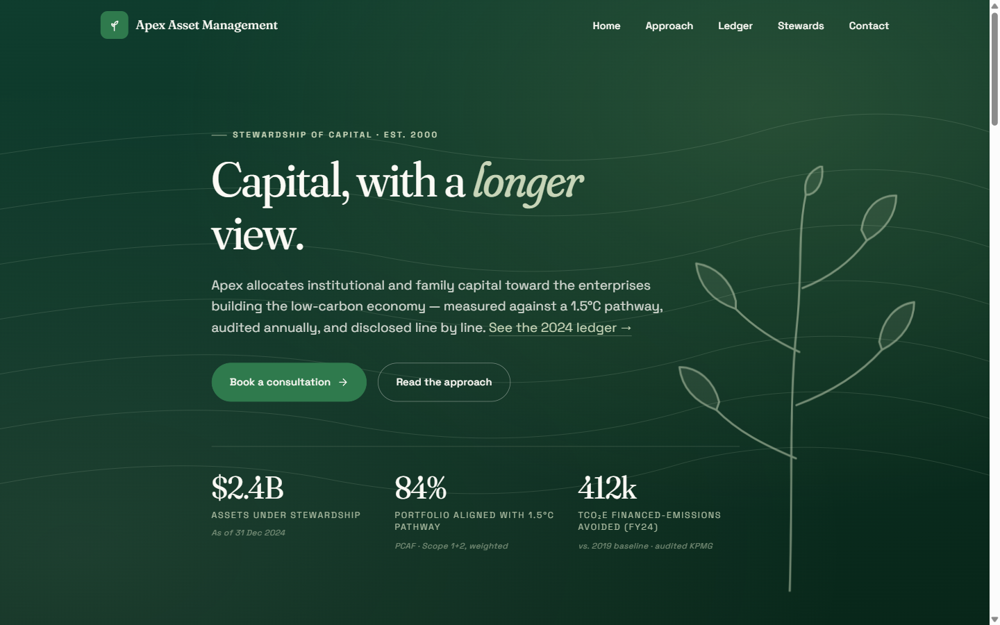

# Apex Asset Management

A single-page marketing site for **Apex Asset Management**, a fictional sustainability-led asset manager. Built as a pure static site — no framework, no build step, no package manager.

**Live site:** https://alfredang.github.io/assetmanagement/



## Stack

- `index.html` — semantic single-page structure
- `styles.css` — design tokens (forest / sage / sand palette), components, responsive rules
- `script.js` — interactivity (IIFE, no modules)

Only runtime dependency: Google Fonts (Fraunces + Space Grotesk + JetBrains Mono).

## Features

- Fixed nav with smooth-scroll anchors (Home, Approach, Ledger, Stewards, Contact)
- Hero with topographic SVG contours, idle-sway sapling accent, and animated ESG stat counters (data-attribute driven)
- "Approach" grid — four stewardship pillars, each backed by a number and a mono-font meta line
- **2024 Impact Ledger** — financial and stewardship metrics in equal-weight columns, with inline methodology disclosures (PCAF / GIPS / ISAE 3410)
- Auto-rotating testimonial carousel (pauses on hover/focus)
- Contact form wired to [FormSubmit](https://formsubmit.co) via async `fetch()`
- Fade-in on scroll via IntersectionObserver
- Full `prefers-reduced-motion` support (pauses sway, skips counter animation, kills transitions)
- Responsive down to mobile

## Running locally

From the project root:

```powershell
python -m http.server 8000
```

Then open http://localhost:8000.

Serving over HTTP is recommended because the contact form uses `fetch()`. The `file://` protocol works too but the form submission won't.

## Deployment

Deployed automatically to GitHub Pages on every push to `main` via the workflow in [.github/workflows/deploy.yml](.github/workflows/deploy.yml).

## Configuration

To make the contact form work with your own email, edit the `action` attribute of the `<form>` in [index.html](index.html):

```html
<form action="https://formsubmit.co/your-email@example.com" ...>
```

FormSubmit will email a confirmation link to that address on the first submission — click it to activate the endpoint.

## Design tokens

All colors, typography, spacing, radii, and shadows are defined as CSS custom properties on `:root` in [styles.css](styles.css). Change them there rather than in individual component rules.

## Performance targets

Lighthouse Performance ≥ 90 and Accessibility ≥ 90. No heavy assets, no blocking scripts, all images sized.
